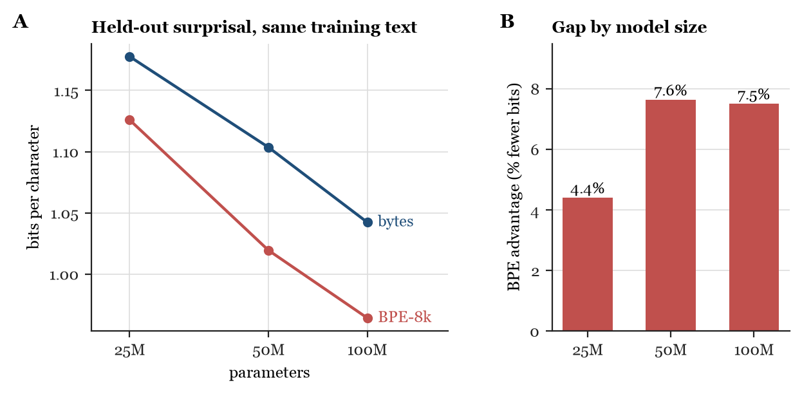
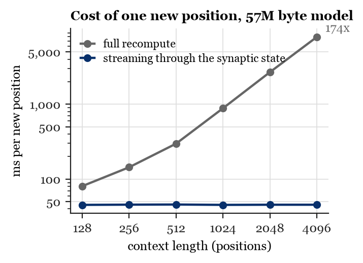
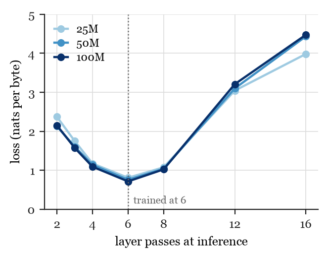

# Small Dragon Hatchling (BDH) models

Code, checkpoints, and raw results from my experiments with the Dragon Hatchling (BDH) architecture
(Kosowski et al., 2025, arXiv:2509.26507). I trained BDH models at 25M, 50M, and 100M parameters on
two alphabets (bytes and an 8,192-token BPE vocabulary), built streaming inference over the model's
synaptic state, and measured the models' recall capabilities, how they respond to tuning, and what their
neurons fire on. A full write-up is in progress. This repository contains everything needed to run the models.

Checkpoints are on Hugging Face: https://huggingface.co/collections/d3vmeh/small-dragon-hatchling-models

## Files in this Repo

| file | what it does |
|---|---|
| `bdh.py` | the reference BDH model code from pathwaycom/bdh, unchanged |
| `streaming.py` | inference that feeds one position at a time into the synaptic state, with an optional sliding window. Streaming matches full recompute to 2e-5 in logits over 512 positions. |
| `chat_stream.py` | a chat CLI on top of `streaming.py`, for the chat-tuned checkpoints (`RAW=1` for base checkpoints) |
| `needle.py` | the planted-fact test: plants "The secret word is X." at a chosen distance and measures how much more likely X becomes, and whether the model says it |
| `pulse_experiment.py` | runs a checkpoint with a different number of passes through its shared layer than it was trained with |
| `eval_100m.py` | bits per character on the held-out text |
| `context_use.py` | bits per character by context-length band |
| `train_scale.py` | the trainer for the 25M and 50M pairs (also trains the matched rotary transformer with `MODEL=gpt`) |
| `train_100m.py`, `train_h100.py` | the two 100M pretraining scripts (BPE on a 4090, bytes on an H100) |
| `tune_spans.py` | the chat tune: standard next-token training with loss only on the assistant's spans |
| `scope_graph.html` | a self-contained visualizer of 203 LLM-labeled neurons of the BPE-100M model and the learned wiring among them.|
| `results/` | the raw result files every number below comes from |
| `figs/` | the three figures below, made from `results/` |

## Model Scores

All models were trained on the same architecture (six shared layers, four heads, 512-position blocks, 54
bytes of text per shared-layer parameter, AdamW, cosine schedule). Held-out text is 3 MB not included in any of the models' training, consisting of part of FineWeb-Edu shard 013 and the TinyStories validation split.

| size | bytes bpc | BPE bpc | gap |
|---|---|---|---|
| 25M | 1.178 | 1.126 | 4.4 % |
| 50M | 1.104 | 1.019 | 7.6 % |
| 100M | 1.042 | 0.964 | 7.5 % |

Bits per character, lower is better, one training seed per size (a second seed at 25M and 50M moved
the gap by 0.3 and 0.2 points). When both alphabets are given the same number of preceding
characters, they score within 0.02 bpc of each other. The gap likely comes from each BPE position seeing
about four times more text.

<p align="center"></p>

Other things I measured:

- Streaming through the synaptic state costs the same per position at any context length, and a
  480-position sliding window stays within 0.01 bpc of re-reading the last 480 positions from scratch,
  through 4,096 positions (`streaming.py`, `test_window_long.py`). I have not yet tested past 4,096 positions.

<p align="center"></p>
- Every base model stores a planted fact (the planted word becomes thousands of times more likely),
  but the byte bases mostly cannot repeat it back when asked. Tuning on questions whose answers sit earlier in the
  context raises recall at 128 characters from 20 % to 97 % for the byte model (`needle.py`).
- Running a model with more or fewer passes than it was trained weakens inference at every size I tested: six passes
  is the minimum on a grid of 2 to 16 (`pulse_experiment.py`).

<p align="center"></p>
- Larger models fire a smaller share of their neurons per position (13.5 % at 25M, 11.2 % at 100M on
  bytes). An untrained model of the same shape fires about 50 %.

## Running the Models

Python 3.10+, PyTorch 2.x, and `tokenizers` for the BPE checkpoints.

Create a `checkpoints/` directory and download the checkpoints from Hugging Face into it, keeping their filenames (`bdh-100m-bytes.pt`
etc.). Every script defaults to that directory. `build_eval_text.py` produces `eval_text_100m.bin`,
the held-out text that `eval_100m.py` and `context_use.py` and the streaming tests score. `data/input.txt`
is the tiny Shakespeare text that `needle.py` uses as filler between the planted fact and the question.

```
# chat with the byte chat model (TEMP=0.3 for repeatable answers)
python chat_stream.py checkpoints/bdh-100m-bytes-chat-v3.pt

# chat with the BPE chat model
python chat_stream.py checkpoints/bdh-100m-bpe8k-chat-v3.pt bpe8k.json

# plain completion from a base model
RAW=1 python chat_stream.py checkpoints/bdh-100m-bytes.pt

# planted-fact probe, ten words, distances in characters
CKPT=checkpoints/bdh-100m-bytes-chat-v3.pt TAG=bytes_v3 NEEDLES=banana,purple,rocket,pencil,tiger,window,silver,castle,honey,lantern python needle.py

# held-out bits per character
BYTES_CKPT=checkpoints/bdh-100m-bytes.pt BPE_CKPT=checkpoints/bdh-100m-bpe8k.pt python eval_100m.py
```

The checkpoints are plain `torch.save` dictionaries with `model` (the state dict), `config` (the
`BDHConfig` fields), and `step`.

```python
import torch, bdh
ck = torch.load("checkpoints/bdh-100m-bytes.pt", map_location="cpu")
model = bdh.BDH(bdh.BDHConfig(**ck["config"]))
model.load_state_dict(ck["model"])
```

## Neuron viewer

`scope/scope_graph.html` is a self-contained page that shows 203 neurons of the BPE-100M model that I
labeled from their strongest firing contexts, and the learned wiring among them. Open the file in a
browser (no server needed), click a neuron to see its label, firing rate, eight example contexts with
the trigger marked, and its strongest partners as signed bars, and use the filters to pick a head or
search the labels. The labels were written by an LLM from the contexts and spot-checked, so treat
them as observations rather than measurements. The scripts that build the data are `scope_export.py`,
`wiring_for_labels.py`, and `wiring_graph.py`.

## Limitations

These are small models trained on 1.4 to 5.4 GB of text. They know the shape of facts before the
facts themselves. The chat tunes make the models worse general language models (held-out bpc rises
by 22 to 29 % for the v3 tunes) because the tuning data was never mixed with pretraining text. The
byte models were trained on 512-position blocks with no state carried between blocks, so they degrade
past 512 positions unless the sliding window is on. Most numbers come from a single training seed.

## License

`bdh.py` is from pathwaycom/bdh and has its copyright notice (see `LICENSE-bdh.md`). Everything
else here is released under MIT license.
